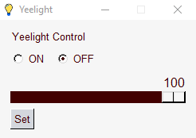

# YeelightControl
 A simple and fast Python GUI app to control your Yeelight device.

‎‏‏‎ ‎

**How to install:**

​	1. Install [Python](https://www.python.org/downloads/)

​	2. Download the [latest release](https://github.com/TriLinder/YeelightControl/releases), and decompress it into a separate folder.

​	3. Install the [yeelight module](https://pypi.org/project/yeelight/) and the [PySimpleGUI module](https://pypi.org/project/PySimpleGUI/).

​	4. Enable `LAN Control` in the official Yeelight app. 

​	5. Run `yeelightControl.pyw`

​	6. Done!

‏‏‎ ‎‎‏‏‎ ‎‏‏‎ ‎

**Screenshots:**

​	
