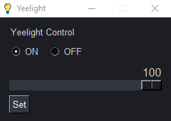

# YeelightControl

 A simple and fast Python GUI app to control your Yeelight device.

‎‏‏‎ ‎‏‏‎ ‎‎‏‏‎ ‎‏‏‎ ‎

**Make sure to enable LAN Control inside the offical Yeelight app**

‏‏‎ ‎‎‏‏‎ ‎‏‏‎ ‎

**How to build to .exe:**

​    1. Install [Python](https://www.python.org/downloads/)

​    2. Clone this repository

    3. Run `pip install -r requirements.txt` inside the folder

    4. Make sure the app works when you launch `yeelightControl.pyw`

    5. If it does, run `build.bat`

    6. Done! You should now find the .exe file in the `dist` directory

‏‏‎ ‎‎‏‏‎ ‎‏‏‎ 

Icon credit: [https://pixabay.com/vectors/lightbulb-lamp-bulb-light-led-6518548/](https://pixabay.com/vectors/lightbulb-lamp-bulb-light-led-6518548/)

**Screenshots:**

​    
    